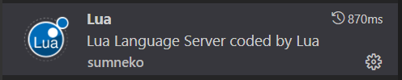
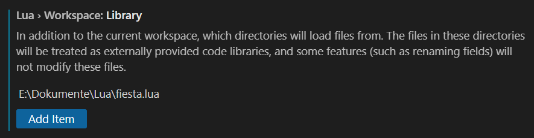
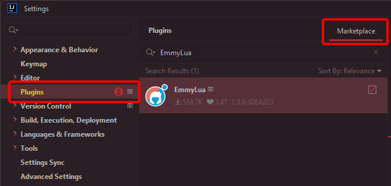

# Setup

You can download the lua definitions that are used to generate the lua documentation with EmmyLua annotations from the link below.

- [Raw File](/files/fiesta.lua)

This file can be used for auto completion in IDEs. Below is the Setup for different IDEs.

## Visual Studio Code

- Install Lua Extension

- Open Settings

- Under Lua > Workspace: Library -> Add Path to fiesta.lua file

## IntelliJ IDEA

#### Installing LUA Plugin
- Open Settings `Ctrl+Alt+S`
- Install "EmmyLua" from the Plugin Marketplace

- Restart the IDE and you are done!

#### Adding Fiesta LUA definitions

- Open Project Settings `Ctrl+Alt+Shift+S`
- Go to `Libraries` and click the `+` sign
- Select `Lua Zip Library` and select the path, where your `fiesta.lua` is located
- Click OK again
